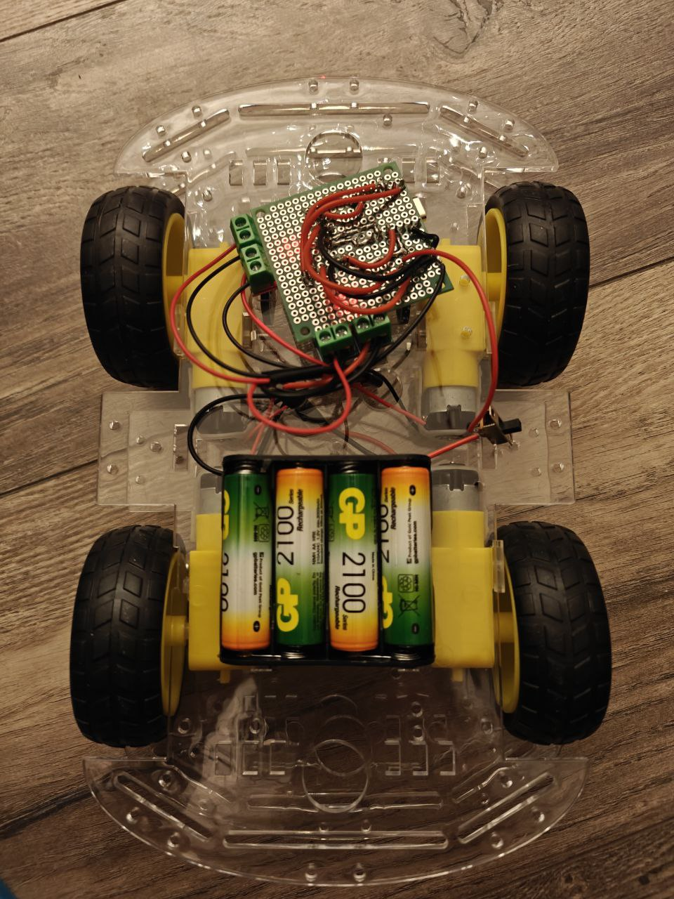

# ESP32-C3 Motor Control Project

Проект для управления роботом на базе ESP32-C3 через BLE с использованием драйверов двигателей L9110S.

Управляемая машинка с 4мя моторами


## 📋 Описание

Этот проект позволяет управлять роботом с четырьмя моторами через Bluetooth Low Energy (BLE). Код написан для платы **Seeed Studio ESP32-C3** и использует драйверы двигателей **L9110S**.

## 🛠 Компоненты

- **Микроконтроллер**: Seeed Studio ESP32-C3
- **Драйверы двигателей**: L9110S (4 шт)
- **Двигатели**: 4 DC мотора
- **Питание**: Внешний источник питания для двигателей

## 🔌 Подключение

### Драйверы L9110S к ESP32-C3:

| Двигатель | Контакт L9110S | Пин ESP32-C3 |
|-----------|----------------|--------------|
| Верхний левый | A-IA | D7 |
| Верхний левый | A-IB | D8 |
| Верхний правый | B-IA | D6 |
| Верхний правый | B-IB | D5 |
| Нижний левый | A-IA | D0 |
| Нижний левый | A-IB | D2 |
| Нижний правый | B-IA | D9 |
| Нижний правый | B-IB | D10 |

## 📁 Структура проекта

```
├── lib
│   ├── BleController
│   │   ├── BleController.cpp
│   │   └── BleController.h
│   ├── Car
│   │   ├── Car.cpp
│   │   └── Car.h
│   └── Motor
│       ├── Moror.cpp
│       └── Moror.h
├── LICENSE
├── platformio.ini
├── README.md
└── src
    └── main.cpp
```

## ⚙️ Настройка

### Требования

- PlatformIO IDE
- Arduino framework
- ESP32 Board Support

### platformio.ini

```ini
[env:seeed_xiao_esp32c3]
platform = espressif32
board = seeed_xiao_esp32c3
framework = arduino
monitor_speed = 115200
lib_deps = 
    # Добавьте необходимые библиотеки для BLE
```

## 🚀 Использование

1. Соберите схему согласно таблице подключений
2. Загрузите код на ESP32-C3
3. Откройте Serial Monitor для отладки (115200 baud)
4. Подключитесь к устройству через BLE с мобильного приложения
5. Управляйте роботом через BLE команды

## 🔧 Функциональность

- **BLE управление**: Прием команд через Bluetooth Low Energy
- **Четыре мотора**: Независимое управление каждым мотором
- **Протокол Serial**: Отладка через последовательный порт
- **Автономная работа**: Программа продолжает работать после инициализации

## 📝 Особенности кода

- Использует объектно-ориентированный подход
- Модульная структура с отдельными классами для Car, Motor и BleController
- Глобальный указатель на контроллер BLE для доступа из разных частей программы

## 🔍 Отладка

Serial monitor выводит:
- Сообщение о запуске программы: "Программа запущена!"
- Периодические сообщения: "Программа работает!" каждые 15 секунд

## ⚠️ Примечания

- Убедитесь, что питание двигателей достаточное и стабильное
- ESP32-C3 пины поддерживают ШИМ для управления скоростью (Пока не реализовано)
- Для работы BLE необходим соответствующий клиент (мобильное приложение)
- Внешние библиотеки должны быть установлены через PlatformIO

---

*Проект создан для управления роботом через BLE с ESP32-C3 и драйверами L9110S*